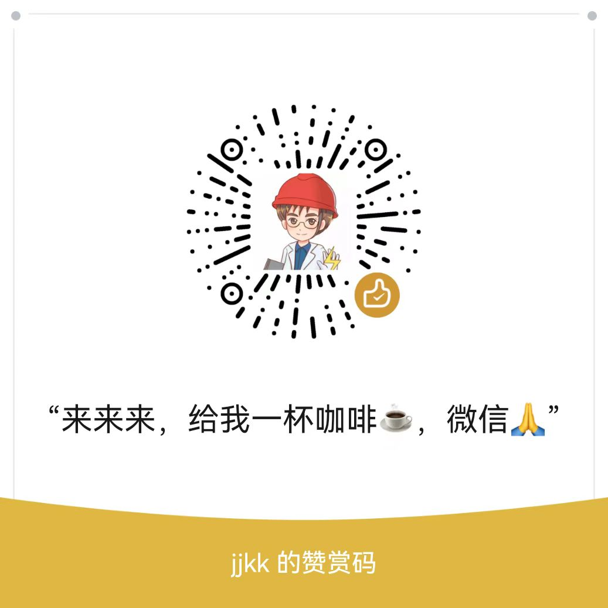

# lgb

## 安装

1. 首先需要python3环境

2. 可以挂青龙面板

---

## 使用

1. 需要直接抓包，可以是手机也可以是电脑.

2. 点击“挑战答题”，抓https://aqy.lgb360.com/aqy/regist/competition这个包，然后返回，不要答题

3. chrome，以cURL(base)格式复制，https://sqqihao.github.io/trillworks.html，粘贴到左边，复制右边的headers，替换源码相关位置.

4. 手机使用fiddle抓包，自行百度，抓包后导出为har格式（1.2），导入chrome，后续见第三条

5. 安装相关依赖，可以运行，不影响已登陆设备。

欢迎进群讨论qq群:808915992

## 说明

配合最新题库更佳!

仅供自己研究使用，不得刷题.

## 赞赏

来来来,给我一杯咖啡，微信.
